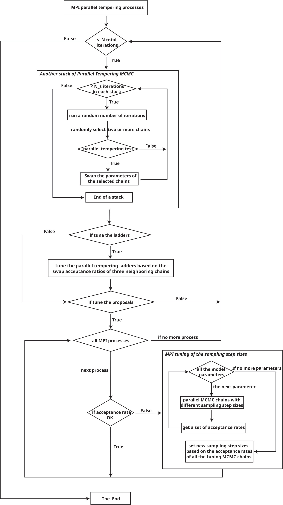

Algorithm
======================

Sampling high-dimensional or multimodal distributions faces two critical obstacles: (1) chains become trapped in local modes, never reaching the global optimum, and (2) no fixed set of proposal widths can simultaneously guarantee efficient early exploration and a high late-stage acceptance rate.

Nii-C resolves these issues with two complementary techniques: parallel tempering, which equips chains to escape local modes, and an automated control system—activated during an initial tuning phase—that jointly optimizes the temperature ladder and every chain’s proposal distributions.

The Nii-C's Automatic Parallel Tempering Markov Chain Monte Carlo (APT-MCMC) algorithm is  fully detailed in the code paper [1]_.  
Listed below are Nii-C’s core subroutines and functions for advanced users who wish to navigate or modify the code.

The Nii-C Workflow
------------------

Nii-C splits the Markov Chain Monte Carlo into two phases.

- ``1`` Initial tuning stage (non-Markovian):
    A control system automatically optimizes the temperature ladder of every parallel-tempering chain, and the Gaussian proposal widths for every model parameter in every chain. This guarantees an effective temperature spacing and a healthy acceptance rate while the sampler first explores the parameter space.

- ``2`` Production stage (Markovian): The control system is frozen; the chains revert to standard parallel-tempering MCMC and satisfy detailed balance, ensuring convergence to the target stationary distributions. 

The figure below summarizes the workflow of the Nii-C code.

.. note::
   Nii-C is designed as a flexible parallel-MCMC engine that can be adapted to diverse sampling tasks simply by adjusting the parameters in ``input.ini``. Please refer to the code paper for different ways of controlling the parallel MCMC process.

Subroutines of Nii-C
---------------------

Below, we describe the primary subroutine files of the Nii-C code.

- ``main.c``: This file contains the main function of the program. It is responsible for configuring and executing the entire APT-MCMC process.
    
- ``mpi_init.c``: It initializes the random values of all model parameters in each parallel tempering Markov Chain.
    
- ``mpi_flow.c``: This file is responsible for scheduling tasks throughout the entire APT-MCMC process. It divides all the parallel tempering Markov Chains into a series of successive segments, which are referred as stacks in the code, and monitors the acceptance rates obtained at the end of each stack. If the acceptance rate of any stack is not within a reasonable range, an additional tuning stage will be scheduled for the corresponding chain.
    
- ``mpi_stack.c``: It performs the random walk of each segment chain within a stack. It further divides the segment chains in a stack into successive batches, which are even short chains, and accesses the swapping criteria between randomly selected parallel tempering chains after each batch. If the criteria for swapping between the chosen parallel chains are met, the current parameter values of the chains will be swapped.
    
- ``mpi_batch.c``: It contains the functions that implement the Metropolis–Hastings MCMC algorithm for each batch.
    
- ``mpi_tune.c``: This file includes all the functions related to the tuning process, which aims to automatically adjust the sampling step sizes of all parallel tempering chains with bad acceptance rates using an automatic control system.
    
- ``mpi_ladder.c``: This file includes a simple algorithm to tune the ladders of the parallel tempering chains in the beginning tuning stage.
    
- ``data_loader.c``: This file contains the functions for loading the user data files.
    
- ``readin.c``: It contains functions for reading the input parameters of Nii-C. These parameters control the overall APT-MCMC process.
    
- ``user_prior.c``: This is a user-defined file that includes the prior functions of a specific model.
    
- ``user_logll.c``: This is another user-defined file for the likelihood functions of a specific model.
    

Key Functions in Nii-C 
----------------------

The following list describes the key functions in the Nii-C code.

- ``calc_closest_ar``: In a tuning stage, this function identifies the acceptance rate that is closest to the ideal value of 0.234 in the two-dimensional array named ``ar_ParmNvaried``. The array records the acceptance rates of ``N_para`` tuning groups comprising ``Nvaried`` tuning chains for each model parameter.

- ``calc_closest_ar_oneparm``: This function finds the acceptance rate closest to the ideal value of 0.234 for a single model parameter. It checks a slice in the two-dimensional array ``ar_ParmNvaried`` that contains the acceptance rates of the tuning group for the model parameter.

- ``calc_sigma_scale_boundary``: This function calculates the upper and lower bounds of the standard deviation of the Gaussian proposal distribution (sampling step size) for each model parameter. These bounds, named as ``sigma_parm_min`` and ``sigma_parm_max``, are necessary for adjusting the sampling step sizes of all parameters during a tuning phase.

- ``calc_SD_allParm``: It calculates the standard deviation of the ``Nvaried`` errors between the ideal acceptance rate and the acceptance rates of all tuning chains  for each model parameter.

- ``check_bounceInside_sigma_boundary``: In a tuning stage, this function assesses whether the newly generated sampling step sizes are within the permissible range of values. If not, it adjusts the value to shift it within the permitted range.

- ``do_gaussian_propose``:  This function uses the Gaussian proposal distribution to produce a new parameter set via the Metropolis-Hastings algorithm.

- ``decide_sigma_to_change``: During the tuning stage, this function creates a new set of sampling step sizes by implementing the tuning Algorithm of Gaussian proposals.

- ``gen_sigma_alltune``: In the tuning stage, this function creates a two-dimensional array called ``sigma_alltune_ParmNvaried`` which contains a range of sampling step sizes adjusted for each model parameter. 

- ``init_gaussian_proposal``: The function generates the initial standard deviation of the Gaussian proposal distribution for each model parameter. 

- ``init_parm_set``: This function generates the random initial values for each model parameter.

- ``iter_batch_mh``:  This function inplements the Metropolis-Hastings MCMC for a short sequence of iterations in a batch.

- ``iter_batch_mh_tune``: It is the  ``iter_batch_mh`` used in the tuning stages.

- ``log_prior``: This function calculates the logarithmic prior for a set of model parameters.

- ``logll_beta``:  The function calculates the tempered logarithmic likelihood of a chain based on its particular β value.

- ``mpi_data_loader``: This function acts as a wrapper for loading the user's data file. 

- ``mpi_distribute_sigma_prop_root``: In an MPI group, the communicator distributes the corresponding sampling step sizes for each model parameter to the other parallel tempering processes in the group.
 
- ``mpi_entire_flow``:  This function serves as a wrapper for the entire APT-MCMC sampling process.

- ``mpi_find_ranks2tune``: The function examines the acceptance rates of all parallel tempering chains and identifies those with bad acceptance rates.

- ``mpi_gather_sigma_prop_root``: The communicator in an MPI group gathers the current  sampling step sizes for each of the model parameter that are used in each of the parallel tempering chains.

- ``mpi_gen_init_parm``: This function generates random initial values for all of the parallel tempering chains' model parameters.

- ``mpi_get_nlines``: The function reads the line number of an input file for each parallel process.

- ``mpi_init_calc_logllpp``: The function computes and gathers the tempered logarithmic likelihood of each parallel chain at the start of an APT-MCMC process, but only for the first iteration.

- ``mpi_judge_and_swap``: This function uses Equation 3 of the code paper to check whether the positions of two parallel chains in the parameter space need to be swapped. If this is the case, it will swap their positions.  

- ``mpi_run_a_batch``: This function will schedule all parallel tempering chains to run the Metropolis-Hastings MCMC algorithm for a short iteration segment in a batch. 

- ``mpi_static_sigma_stack``: The function employs constant sampling step sizes to execute parallel tempering MCMC for segment chains in a stack. 

- ``mpi_tune_sigma_iparmNrank``:  This function creates a group of tuning chains for a model parameter and computes the acceptance rates of these tuning chains. 

- ``mpi_tune_sigma_irank``:  For a parallel tempering chain that requires tuning, this function  generates new groups of tuning chains for each model parameter in turn and then collects the acceptance rates resulting from all the tuning chains.  

- ``modify_sigma_prop_rankintune``: This function adjusts the sampling step sizes of a tuning chain using Algorithm 1 of the code paper.

- ``para_boundary``:  It verifies whether the value of each parameter falls within the allowable range. If not, it modifies the value to bring it within the permitted range.

- ``race_all_parm``: This function aggressively adjusts the step sizes of all parameters. It selects the new step size for each parameter from ``N_varied`` tuning values. The chosen value being the one that yields an acceptance rate closest to the ideal rate of 0.234. 

- ``read_input_ini``:  It is a wrapper function that reads all the input parameters defined in the ``input.ini`` file.

- ``replicate_OneSigmaOrigin_Nvaried``:  This function copies the current sampling step sizes of a tuning chain from a two-dimensional array called ``sigma_RanksParm_root`` which is stored in the MPI communicator. Afterwards, it generates multiple  copies of this set of sampling step sizes for ``Nvaried`` tuning chains.

- ``save_ar_stack``: If the debug option is enabled, this function outputs the acceptance rates in a stack for each parallel tempering chain in the results directory. These acceptance rates are saved with a filename of ``accept_rate_stacks.chain`` + an integer representing its  ``MPI_Comm_rank``.  

- ``save_debug_gaussian_proposal``:  During debugging, it saves all the sampling step sizes in the results directory with a filename of ``debug_gaussian_prop``.

- ``save_debug_para_boundary``: When in debug mode, it saves all the proposed values of a parameter in its random walk with a filename of the paramter name + ``.debug_para_boundary`` to verify that they are within the permitted range. 

- ``save_debug_stack_doswap``: In debug mode, this function records all swapping decisions as ``swap_decision.dat`` in the results directory.

- ``save_debug_stack_sequence``: In debug mode, this function outputs the sequence numbers in a stack whenever swapping decisions are made.

- ``save_init_parm``: In debug mode, it saves the random initial model parameters of all the parallel tempering chains as ``init.parm`` in the results directory.

- ``save_log_posterior``: If a save option is turned on, this function outputs the model parameters, their corresponding logarithmic prior,  tempered likelihood, and posterior of all proposed sampling points in the results directory. The files created will have names that end in ``.all.ll``.

- ``save_sigma_gauss_prop``: This function outputs the sampling step sizes of all model parameters of each parallel tempering chain in the results directory  with a filename of ``gaussian_prop.chain`` + an integer representing its  ``MPI_Comm_rank``.

- ``save_the_batch``:  This function returns the main output of the Nii-C code. It stores the model parameters, the calculated logarithmic posterior, the index numbers in the entire Markov chain, and the cumulative number of accepted sampling proposals at each iteration for each parallel tempering chain with a filename of ``Chain`` + an integer representing its ``MPI_Comm_rank`` + ``.dat``.

- ``save_the_batch_tune``: In tuning stages,  this function records all sampled model parameters and their resulting logarithmic posteriors if a debug option is turned on. These output filenames begin with ``tune.``.

- ``save_the_seed``: In debug mode, it saves the initial random seeds used by each parallel tempering chain in the results directory as ``init.randseed``.

- ``save_tuning_sigma_ar``: If a save option is enabled, this function will store the new sampling step sizes and their corresponding acceptance rates of all tuning chains in the results directory, with names starting with ``sigma_ar_intune.``.

- ``swap_two_chains``: This function interchanges the positions in the parameter space of two parallel tempering chains.

- ``tune_oneparm_Nvaried``:  In a tuning process, this function updates the ``sigma_tune1parm_NvariedParm`` array. The array consists of ``Nvaried`` sets of new sampling step sizes for a group of tuning chains that are used to adjust the step size of a model parameter. The new values for the sampling step sizes of the group of tuning chains are provided in an array named ``sigma_alltune_ParmNvaried``. 

.. [1]  https://ui.adsabs.harvard.edu/abs/2024ApJS..274...10J/abstract

